# Getting started with ocean3d

Marine species inhabit a three-dimensional environment. However, their
geographical distributions are often represented using two-dimensional
maps, which show where a species occurs without considering the depths
it occupies.

This distinction matters. Two species may share the same geographical
distribution but occupy entirely different depths. Similarly,
environmental conditions such as temperature can change considerably
throughout the water column.

**How can we incorporate depth into our spatial analyses to better
understand the environmental conditions experienced by marine species?**

`ocean3d` is an R package designed to incorporate the vertical dimension
into marine spatial analyses. It provides tools to represent species
distributions, fisheries and environmental variables in three
dimensions, allowing us to investigate their spatial relationships,
identify overlaps and extract or summarise information across different
depths.

Rather than treating the ocean as a two-dimensional surface, `ocean3d`
allows us to account for how marine habitats and environmental
conditions vary throughout the water column.

In this tutorial, we will explore how `ocean3d` helps us answer this
question by exploring some of the package’s core functionalities through
a simple, reproducible example.

## Our research question

Imagine we are studying a marine species for which we know:

- Its geographical distribution, represented by a polygon.
- Its vertical distribution (e.g., extending from the surface to a
  maximum depth of 600 metres).
- The bathymetry of our study area.

Additionally, we know the environmental conditions of such
three-dimensional space, for example:

- Ocean temperature at several depths throughout the water column.

Using `ocean3d`, we will combine the species’ geographical distribution,
depth range and bathymetry to represent its potential three-dimensional
distribution. We will then integrate environmental data to identify and
summarise the temperatures occurring within this space.

To keep things simple, we will use small, artificially generated
datasets. This allows us to focus on understanding the workflow without
downloading external data.

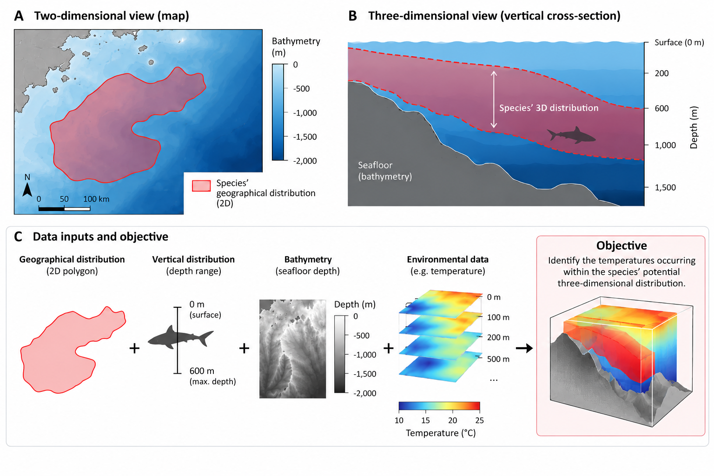

*Figure 1. Conceptual overview of the tutorial. A species’ geographical
distribution and depth range are combined with bathymetry to represent
its potential three-dimensional distribution. Environmental data are
then used to characterise the conditions within this space.*

## How does `ocean3d` represent three-dimensional space?

To combine species distributions with environmental information, we need
a way to represent both datasets in three dimensions.

`ocean3d` uses two main spatial representations:

- **`SpatEnvelope`** represents a three-dimensional distribution using
  two raster layers: `depth_min` and `depth_max`. Each geographical cell
  contains the minimum and maximum depths defining its vertical
  interval. Consequently, the vertical extent can vary between
  geographical locations.

- **`SpatVoxel`** represents three-dimensional information using a stack
  of raster layers, each corresponding to a specific depth. Its layers
  follow the naming convention `{variable}_depth={value}`, allowing
  environmental conditions or other spatial information to be
  represented at different depths.

The key difference is **how depth is represented**. In a `SpatEnvelope`,
depth is stored as the cell value, defining a vertical interval. In a
`SpatVoxel`, depth identifies the raster layer, representing information
at a particular depth level.

| Object | What it is |
|----|----|
| `SpatEnvelope` | The species’ 3D range. Two layers, `depth_min` and `depth_max`; **depth is the cell value**, so the vertical interval varies per cell. |
| `SpatVoxel` | The environmental raster. One layer per standard depth, named `{variable}_depth={value}`; **depth is the layer index**. |

Figure 2 illustrates how the same species’ three-dimensional
distribution can be represented using either a `SpatEnvelope` or a
`SpatVoxel`. The
[`envelope_to_voxel()`](https://marine-biodiversity-conservation-lab.github.io/ocean3d/reference/envelope_to_voxel.md)
function from `ocean3d` will enable us to convert and `SpatEnvelope`
into a `SpatVoxel`, distributing the species’ potential presence across
a set of predefined depth levels. Each level represents an interval of
water rather than an infinitely thin horizontal plane. Consequently, the
geographical area occupied by the species may differ between depth
levels.

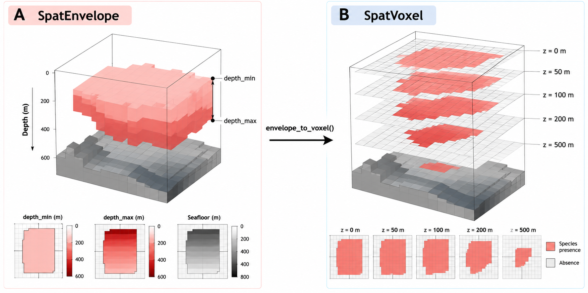*Figure 2. Comparison
of the two three-dimensional spatial representations used by `ocean3d`.
(A) A `SpatEnvelope` defines a species’ potential distribution using
minimum and maximum depths, constrained by the local bathymetry. (B) The
same distribution is converted into a `SpatVoxel`, representing
potential species presence at five predefined depth levels (0, 50, 100,
200 and 500 m) using
[`envelope_to_voxel()`](https://marine-biodiversity-conservation-lab.github.io/ocean3d/reference/envelope_to_voxel.md).
The illustration is conceptual and based on the synthetic example
presented in this tutorial.*

A `SpatEnvelope` is particularly useful when we know the geographical
distribution and vertical limits of a species, but do not have detailed
information about how it is distributed throughout the water column. For
example, we may have an IUCN distribution polygon and the species’
minimum and maximum recorded depths. Combining these with bathymetry
allows us to represent its potential three-dimensional distribution
without assuming that we know its precise distribution at each depth.

A `SpatVoxel`, on the other hand, is useful when we need to represent or
analyse information at specific depth levels. For example, oceanographic
datasets often provide temperature or dissolved oxygen measurements at
several standard depths. This representation also allows us to examine
species distributions or fishing activity at different depths, including
situations where occupancy or intensity varies throughout the water
column.

**The two representations are complementary.** We can use a
`SpatEnvelope` to define a species’ potential three-dimensional
distribution and convert it into a `SpatVoxel` to compare it with
environmental datasets organised into depth layers.

In this tutorial, we will create both representations, convert between
them and use them together to identify the temperatures occurring within
our species’ potential three-dimensional distribution.

Don’t worry if these concepts are not immediately clear. We will build
each object step by step and explore its structure as we progress
through the tutorial.

## Getting started: preparing our data

Now that we have defined our research question, let’s start building the
datasets we need to answer it.

As illustrated in Figure 1, our analysis requires four main inputs:

1.  A **study area**, defining the geographical extent of our analysis.
2.  **Bathymetry**, describing the depth of the seafloor across our
    study area.
3.  A species’ **geographical distribution and depth range**, which
    together define its potential three-dimensional distribution.
4.  **Environmental data**, in our case ocean temperature at different
    depths.

Throughout this tutorial, we will use small, artificially generated
datasets that represent these inputs. This allows us to explore the main
functionalities of `ocean3d` without downloading external datasets or
requiring API credentials.

For real-world applications, `ocean3d` provides several functions to
facilitate data acquisition and preparation. These include
[`load_gebco_bathymetry()`](https://marine-biodiversity-conservation-lab.github.io/ocean3d/reference/load_gebco_bathymetry.md)
for bathymetric data from GEBCO,
[`woa_download()`](https://marine-biodiversity-conservation-lab.github.io/ocean3d/reference/woa_download.md)
and
[`woa_load_nc()`](https://marine-biodiversity-conservation-lab.github.io/ocean3d/reference/woa_load_nc.md)
for environmental data from the World Ocean Atlas, and
[`fetch_species_assessments()`](https://marine-biodiversity-conservation-lab.github.io/ocean3d/reference/fetch_species_assessments.md)
for retrieving species information, including depth limits, from the
IUCN Red List API.

Species distribution polygons can be obtained separately, for example,
from the IUCN Red List spatial datasets. These can then be combined with
species-specific depth limits and bathymetry using
[`vect_to_envelope()`](https://marine-biodiversity-conservation-lab.github.io/ocean3d/reference/vect_to_envelope.md)
to create three-dimensional species distributions.

Support for downloading Copernicus data through `copernicus_load()` is
also under development. Stay tuned!

We will introduce these data sources and their corresponding functions
as we progress through the tutorial.

If you would like to explore complete analyses using real datasets, see
the [additional articles](#next-steps) at the end of this tutorial.

## Installing `ocean3d`

`ocean3d` is currently available from GitHub. You can install the latest
development version using:

``` r

# install.packages("remotes")
remotes::install_github("Marine-Biodiversity-Conservation-Lab/ocean3d")
```

Once installed, load the package with:

``` r

library(ocean3d)
```

## Step 1: Creating our study area and bathymetry

Before representing our species’ distribution in three dimensions, we
need to define the geographical area where our analysis will take place
and understand the bathymetry landscape within it.

### 1.1. Defining our study area

We begin by creating a simple geographical grid using the `terra`
package. A grid divides our study area into individual cells, allowing
us to organise and analyse spatial information.

Each cell represents a geographical location where we can store
information about the seafloor, species distributions or environmental
conditions.

For simplicity, our example uses a grid of 20 × 20 cells, representing a
total of 400 geographical cells.

All subsequent datasets will use this same grid, ensuring that their
spatial information is aligned.

``` r

# Create a geographical grid with 20 rows and 20 columns.
grid <- terra::rast(nrows = 20, ncols = 20, 
                    xmin = 0, xmax = 20, ymin = 0, ymax = 20,  
                    crs = "EPSG:4326")

grid
#> class       : SpatRaster
#> size        : 20, 20, 1  (nrow, ncol, nlyr)
#> resolution  : 1, 1  (x, y)
#> extent      : 0, 20, 0, 20  (xmin, xmax, ymin, ymax)
#> coord. ref. : lon/lat WGS 84 (EPSG:4326)
```

Our grid contains 400 cells, each covering one degree of latitude and
longitude. This artificial study area provides the common spatial
framework for the datasets we will create next.

### 1.2. Representing the seafloor

The next step is to represent the bathymetry of our study area.

This is particularly important when working in three dimensions because
the seafloor defines the lower boundary of the water column.

For example, a species may inhabit depths of up to 600 metres, but it
cannot occupy depths below the seafloor. Where the seabed is only 200
metres deep, the available water column is limited to those first 200
metres.

In our example, we will create an artificial continental shelf that
gradually deepens from north to south, with seafloor depths ranging from
20 to 900 metres.

**Depth convention:** Throughout `ocean3d`, depths are expressed as
positive values increasing downwards. For example, a depth of 200 metres
is represented as `200`, rather than `-200`.

``` r

# Create a raster using the geometry of our study grid.
seafloor <- terra::rast(grid)

# Assign seafloor depths ranging from 20 to 900 metres.
terra::values(seafloor) <- rep(seq(20, 900, length.out = 20),  each = 20)

# Visualise the bathymetry of our study area.
terra::plot(seafloor, main = "Seafloor depth (m)", xlab = "Longitude",  ylab = "Latitude")
```

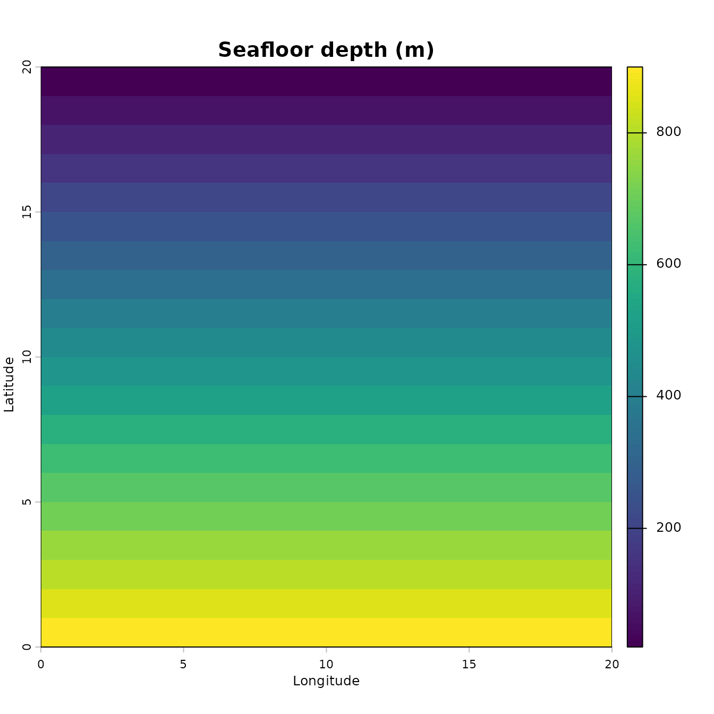

The resulting map shows our artificial bathymetry. Each grid cell
contains the seafloor depth at a particular geographical location, with
shallower waters in the north and deeper waters in the south.

But what does an individual grid cell actually represent?

As illustrated in Figure 3, each cell corresponds to a geographical
location with its own water column, extending from the ocean surface to
the local seafloor. Consequently, the maximum depth of the water column
(i.e. bathymetry) varies across our study area.

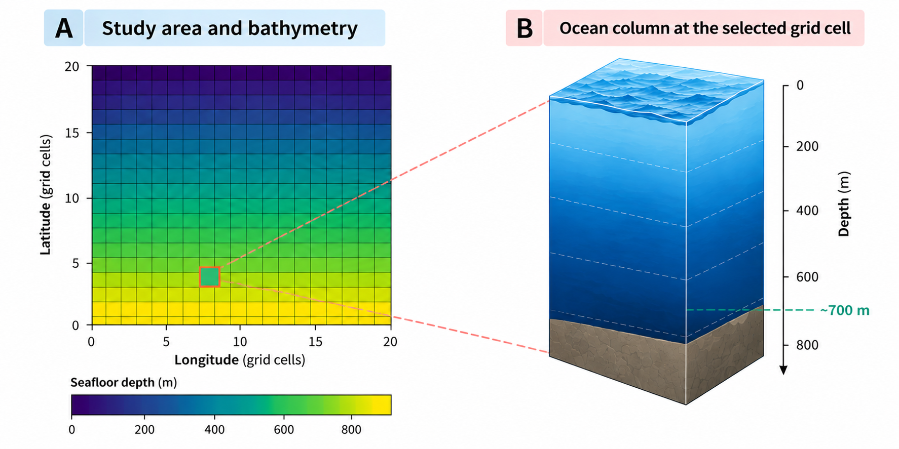*Figure 3. Illustrated concept of
bathymetry grid. (A) Our synthetic study area, represented by a 20 × 20
grid in which each cell stores the local seafloor depth
(i.e. bathymetry). The highlighted cell illustrates a location with a
bathymetry of approximately 700 m. (B) Conceptual representation of the
corresponding water column, extending from the ocean surface (0 m) to
the local seafloor. Depths are expressed as positive values increasing
downwards.*

This variation will become important when we introduce our species’
distribution. Although the species may have a maximum depth limit of 600
metres, its potential vertical distribution will also depend on the
local seafloor depth.

In other words, **the species’ depth range and the bathymetry must be
considered together** to identify the three-dimensional space it could
potentially occupy.

**Working with real data:** In real-world applications, bathymetric data
can be obtained from GEBCO using
[`load_gebco_bathymetry()`](https://marine-biodiversity-conservation-lab.github.io/ocean3d/reference/load_gebco_bathymetry.md).
Since GEBCO provides elevation values, underwater elevations must be
converted to positive-down depths before using them in this workflow.

## Step 2: Creating our environmental data

Now that we have defined our study area and its bathymetry, we need to
represent the environmental conditions throughout the water column.

In our example, we will use ocean temperature. Unlike bathymetry, which
provides one value per geographical cell, temperature can vary both
geographically and with depth.

To represent this variation, we will create a synthetic environmental
dataset organised as a `SpatVoxel` (i.e., one layer per standard depth).

### 2.1. Defining our depth levels

Oceanographic datasets, such as those provided by the World Ocean Atlas
(WOA), commonly organise environmental variables into raster layers
corresponding to standard depth levels.

For our example, we will use five depths: 0, 50, 100, 200 and 500
metres. Each depth will correspond to a separate raster layer covering
our study area.

``` r

# Define the five depth levels represented in our environmental data.
standard_depths <- c(0, 50, 100, 200, 500)
standard_depths
#> [1]   0  50 100 200 500
```

Notice that the intervals between consecutive depth levels are not
necessarily equal. This is common in oceanographic datasets, where
vertical sampling resolution may vary throughout the water column.

### 2.2. Generating synthetic temperature data

Next, we will generate artificial temperature values for each of our
five depth levels.

To make our example more realistic, we will introduce two simple
environmental gradients:

- **Vertical variation:** temperature decreases with depth.
- **Horizontal variation:** temperature varies with latitude.

We will use the same geographical grid created in Step 1, ensuring that
our temperature data are spatially aligned with the bathymetry.

``` r

# Create a raster containing the latitude of each cell.
lat <- terra::init(terra::rast(grid), "y")

# Generate one temperature raster for each depth level.
t_layers <- lapply(standard_depths,  
                   # Temperature decreases with both depth and latitude:
                   function(d) 26 - 0.03 * d - 0.4 * lat)

# Visualise temperature at each depth before introducing ocean3d.
temperature_layers <- terra::rast(t_layers)
names(temperature_layers) <- paste0(standard_depths, " m")
terra::plot(
  temperature_layers,
  main = paste0("Temperature at ", standard_depths, " m"),
  col = hcl.colors(100, "YlOrRd", rev = TRUE),
  range = range(terra::minmax(temperature_layers), na.rm = TRUE),
  xlab = "Longitude", ylab = "Latitude")
```

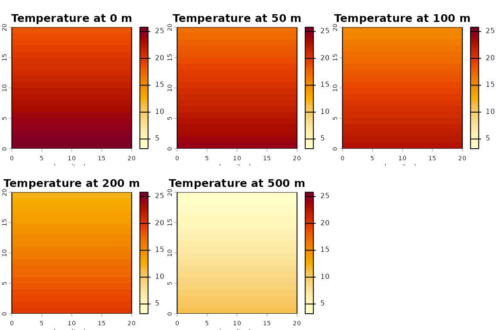

Our artificial temperature model starts with a reference temperature of
26 °C and decreases by 0.03 °C per metre of depth and 0.4 °C per degree
of latitude (These values are illustrative and are not intended to
represent the actual oceanographic conditions of any particular region).

The result is a collection of five temperature rasters, each
representing the environmental conditions at a different standard depth.

### 2.3. Creating our `SpatVoxel`

We can now combine these temperature rasters into a single
three-dimensional representation using
[`as_voxel()`](https://marine-biodiversity-conservation-lab.github.io/ocean3d/reference/as_voxel.md)
(i.e., each raster will become a layer of our `SpatVoxel`)

This function assigns the appropriate layer names and validates the
depth axis, allowing `ocean3d` to recognise the depth associated with
each raster layer.

``` r

# Organise the same five rasters along a vertical depth axis 
# by generating a single voxel feature
t_annual <- as_voxel(
  terra::rast(t_layers),
  depths = standard_depths,
  varname = "t_an")

names(t_annual)
#> [1] "t_an_depth=0"   "t_an_depth=50"  "t_an_depth=100" "t_an_depth=200"
#> [5] "t_an_depth=500"
```

Notice that each layer name contains two pieces of information: the
environmental variable (`t_an`, annual temperature) and its
corresponding depth. For example, `t_an_depth=100` represents the
temperature raster at a depth of 100 metres.

Rather than extracting depth information manually from the layer names,
we can use the
[`depths()`](https://marine-biodiversity-conservation-lab.github.io/ocean3d/reference/depths.md)
function to retrieve the numerical depth axis.

``` r

depths(t_annual)
#> [1]   0  50 100 200 500
```

We now have a `SpatVoxel` containing temperature information across our
study area at five different depth levels.

**Working with real data:** Instead of generating artificial temperature
rasters, we could obtain environmental data from the World Ocean Atlas
using
[`woa_download()`](https://marine-biodiversity-conservation-lab.github.io/ocean3d/reference/woa_download.md)
and
[`woa_load_nc()`](https://marine-biodiversity-conservation-lab.github.io/ocean3d/reference/woa_load_nc.md).

### 2.4. Visualising our 3D environmental data

The following visualisation illustrates how our temperature layers are
organised vertically, with each layer positioned at its corresponding
depth within our `SpatVoxel`.

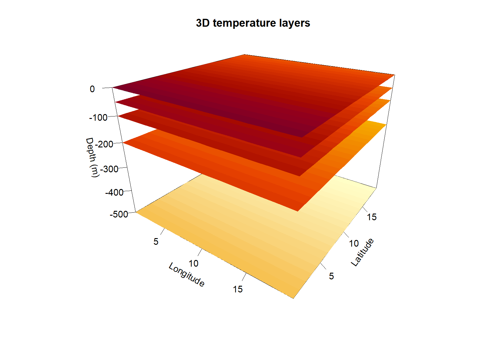

Each panel represents the same geographical study area, but at a
different depth. Notice that the vertical distance between layers
reflects their actual depth intervals.

Notice how temperature changes both geographically and vertically. In
our synthetic example, deeper layers contain lower temperatures, while
the latitudinal gradient is preserved across all five depth levels.

This is precisely why incorporating the vertical dimension matters:
**environmental conditions at the same geographical location can differ
considerably depending on depth.**

## Step 3: Creating our species’ three-dimensional distribution

We now have two important components of our study area: its bathymetry
(Step 1) and environmental conditions at different depths (Step 2). The
next step is to represent the three-dimensional space that our species
could potentially occupy within those.

To do this, we need three pieces of information:

- **Geographical distribution:** where our species could potentially
  occur.
- **Vertical distribution:** the minimum and maximum depths at which the
  species can occur.
- **Bathymetry:** the local seafloor depth, which limits the available
  water column.

We will combine these components on a `SpatEnvelope`, using
[`vect_to_envelope()`](https://marine-biodiversity-conservation-lab.github.io/ocean3d/reference/vect_to_envelope.md)
which will represent the potential vertical distribution of our species
at each geographical location.

### 3.1. Defining our species’ geographical distribution

First, let’s create a simple polygon representing our species’
geographical range. For this example, we will use a rectangular polygon
covering part of our artificial study area.

``` r

# Create a simple polygon representing the species' geographical range.
poly <- terra::vect("POLYGON ((4 2, 16 2, 16 18, 4 18, 4 2))", crs = "EPSG:4326")

# Plot the study grid and the species' geographical range.
terra::plot(seafloor,  main = "Species' geographical distribution",
  xlab = "Longitude",  ylab = "Latitude")
terra::plot(poly, add = TRUE, border = "red", lwd = 3)
```

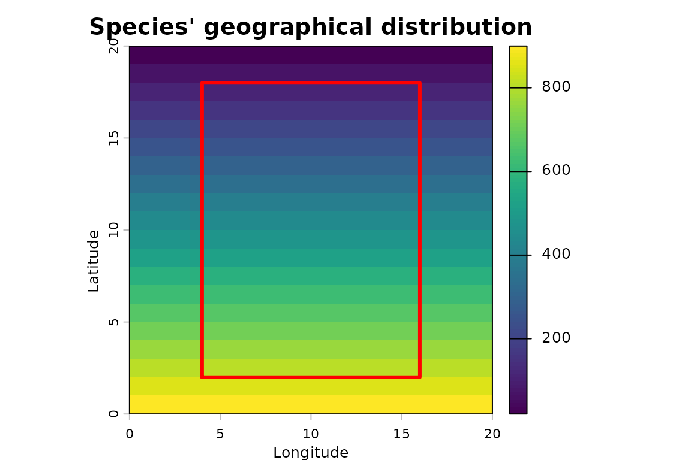 This polygon
defines the geographical boundaries of our species’ potential
distribution. However, it does not provide information about the depths
at which the species can occur.

In a real application, these two types of information can be obtained
from the IUCN Red List:

- **Geographical distribution:** species range polygons can be obtained
  from the [IUCN Red List Spatial
  Data](https://www.iucnredlist.org/resources/spatial-data-download).
- **Vertical distribution:** species depth limits can be retrieved from
  their Red List assessments using
  [`fetch_species_assessments()`](https://marine-biodiversity-conservation-lab.github.io/ocean3d/reference/fetch_species_assessments.md).

For our synthetic example, we will assume that our species can occur
between the ocean surface (0 m) and a maximum depth of 600 m.

### 3.2. Combining the polygon, depth limits and bathymetry

We can now create our species’ potential three-dimensional distribution.

We will combine these components into a SpatEnvelope using
[`vect_to_envelope()`](https://marine-biodiversity-conservation-lab.github.io/ocean3d/reference/vect_to_envelope.md),
which represents our species’ potential vertical distribution at each
geographical location. The function
[`vect_to_envelope()`](https://marine-biodiversity-conservation-lab.github.io/ocean3d/reference/vect_to_envelope.md)
rasterises our polygon onto the study grid and assigns minimum and
maximum depths to each occupied cell.

Importantly, we must also consider the local bathymetry. Even if our
species can occur down to 600 m, it cannot occupy depths below the
seafloor.

To account for this,
[`vect_to_envelope()`](https://marine-biodiversity-conservation-lab.github.io/ocean3d/reference/vect_to_envelope.md)
accepts multiple maximum depth constraints through its `depth_max`
argument.

**The seafloor is not a special argument:** it is simply another maximum
depth constraint. For each cell, the function applies the shallowest of
the supplied maximum-depth constraints.

Let’s combine our geographical polygon, biological depth limits and
bathymetry:

``` r

# Combine three pieces of information:
# Convert a geographical polygon into a SpatEnvelope by rasterising the polygon and adding a vertical range to each occupied cell.
range_env <- vect_to_envelope(
  polygon = poly,                  
  template = grid,                 # Where? -> Common geographical range polygon
  depth_min = 0,                   # How deep? -> biological depth range (0-600 m)
  depth_max = list(600, seafloor))  # How deep is possible? -> local seafloor depth

# The result is our species' potential 3D distribution as a SpatEnvelope.
range_env
#> class       : SpatRaster
#> size        : 20, 20, 2  (nrow, ncol, nlyr)
#> resolution  : 1, 1  (x, y)
#> extent      : 0, 20, 0, 20  (xmin, xmax, ymin, ymax)
#> coord. ref. : lon/lat WGS 84 (EPSG:4326)
#> source(s)   : memory
#> names       : depth_min,  depth_max
#> min values  :         0, 112.631579
#> max values  :         0,        600
```

Here:

- `polygon` defines our species’ geographical range.
- `template` specifies the grid onto which the polygon will be
  rasterised.
- `depth_min = 0` defines the shallowest depth at which our species can
  occur.
- `depth_max = list(600, seafloor)` combines the species’ biological
  maximum depth with the local seafloor depth.

For example, if the seafloor is at 200 m, our species can potentially
occupy the water column between 0 and 200 m. However, if the seafloor is
at 800 m, its potential distribution extends only to its biological
maximum depth of 600 m.

The resulting `SpatEnvelope` contains two rasters: `depth_min` and
`depth_max`. Together, they define the potential vertical distribution
of our species at each geographical location within its range.

Let’s visualise both depth limits:

``` r

# Plot minimum and maximum depth layers
terra::plot(range_env,
  main = c("Minimum depth (m)", "Maximum depth (m)"),
  xlab = "Longitude",  ylab = "Latitude")
```

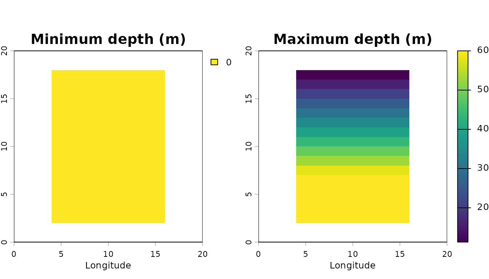

The two maps represent different components of our species’ potential
vertical distribution:

- **`depth_min`:** the shallowest depth our species can potentially
  occupy. In this example, it is 0 m throughout its geographical
  distribution.
- **`depth_max`:** the deepest limit of its potential distribution at
  each geographical location, constrained by both its biological depth
  limit and the local bathymetry.

Notice that the maximum depth is shallower in the northern part of the
species’ range, where the seafloor is closer to the surface. Further
south, where the seafloor is deeper, our species can reach its full
biological maximum depth of 600 m. Importantly, **these maps represent
the potential vertical limits of our species, not its observed depth or
abundance**.

Let’s examine the maximum depths in our newly created `SpatEnvelope`.

``` r

range(terra::values(range_env[["depth_max"]]),
  na.rm = TRUE)
#> [1] 112.6316 600.0000
```

Although we specified a biological maximum depth of 600 m, the resulting
maximum depths vary geographically because of the bathymetric
constraint.

Our original geographical polygon has now become a three-dimensional
representation of the space our species could potentially occupy, as a
SpatEnvelope:


## Step 4: Converting our species’ distribution into a `SpatVoxel`

We now have two three-dimensional datasets:

- **Our species’ potential distribution**, represented by a
  `SpatEnvelope`, which stores the minimum and maximum depths that the
  species could occupy at each location.
- **Our environmental data**, represented by a `SpatVoxel`, which stores
  temperature values at five predefined depth levels: 0, 50, 100, 200
  and 500 m.

However, these two objects represent depth differently. Before we can
combine our species’ distribution with environmental conditions, we need
to express them using the same vertical structure.

We can achieve this using
[`envelope_to_voxel()`](https://marine-biodiversity-conservation-lab.github.io/ocean3d/reference/envelope_to_voxel.md).

### 4.1. Converting our `SpatEnvelope`

The function
[`envelope_to_voxel()`](https://marine-biodiversity-conservation-lab.github.io/ocean3d/reference/envelope_to_voxel.md)
converts the continuous depth intervals stored in our `SpatEnvelope`
into a series of raster layers corresponding to predefined depth levels.

We will use exactly the same depth levels as our temperature dataset.
This ensures that both objects share the same vertical structure.

``` r

# Convert our SpatEnvelope into a SpatVoxel by evaluating potential
# species occupancy at the same depth levels as our environmental data.
occ <- envelope_to_voxel(
  range_env,                  # Species' potential 3D distribution
  depths = depths(t_annual),  # Use the same depths as our temperature data
  bounds = "midpoint")        # Define intervals around each depth level

# Count how many grid cells the species can potentially occupy at each depth.
terra::global(occ, "sum", na.rm = TRUE)
#>                    sum
#> presence_depth=0   192
#> presence_depth=50  192
#> presence_depth=100 192
#> presence_depth=200 180
#> presence_depth=500 120
```

The resulting `SpatVoxel` contains five layers, one for each depth level
in our temperature dataset. Unlike our temperature data, this object
represents potential species occupancy:

- `1`: the species could potentially occupy the corresponding part of
  the water column.
- `NA`: that part of the water column falls outside the species’
  potential distribution.

Because occupied cells contain a value of `1`,
[`terra::global()`](https://rspatial.github.io/terra/reference/global.html)
allows us to count how many geographical cells are potentially occupied
at each depth level. Notice that our species can potentially occupy 192
geographical cells at 0, 50 and 100 m. However, this decreases to 180
cells at 200 m and 120 cells at 500 m.

Why does the number of occupied cells decrease with depth?

Remember that our species has a maximum depth limit of 600 m, but its
potential distribution is also constrained by the local bathymetry. As
we move into deeper layers, some geographical cells no longer contain
sufficient water depth to fall within the corresponding depth intervals.
Importantly, these values represent the number of potentially occupied
geographical cells, not the number of individual animals or observations
of the species.

You may have noticed an additional argument in our code:
`bounds = "midpoint"`. Why do we need it?

Our temperature data are organised into five standard depth levels. To
combine these data with our species’ potential distribution, we need to
represent both datasets using the same depth levels.

The argument `bounds = "midpoint"` defines how the water column is
divided into intervals around those depths. We will use this convention
throughout our example.

For further details, including how these intervals are calculated and
why they matter, see the [Understanding depth
levels](https://marine-biodiversity-conservation-lab.github.io/ocean3d/articles/depth-levels.md)
vignette.

### 4.2. Visualising our species’ potential occupancy

Now that we have converted our species’ distribution into a `SpatVoxel`,
let’s visualise how its potential geographical distribution changes
across our five depth levels.

``` r

# Visualise the SpatVoxel layers on the species occupancy across our depth levels.
terra::plot( 
  occ,  nc = 3,  legend = FALSE,  col = "steelblue",
  main = paste("Potential occupancy at", depths(occ), "m"),
  xlab = "Longitude",  ylab = "Latitude")
```

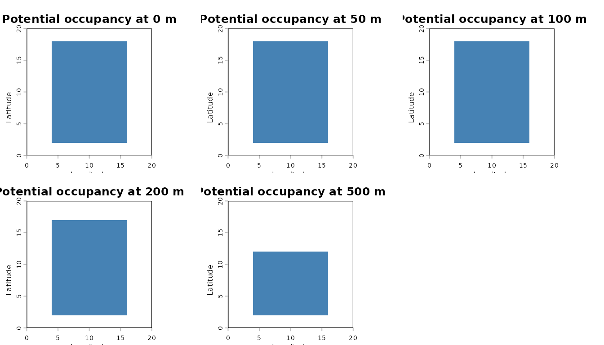

Each panel represents the species’ potential geographical distribution
at a different depth level. The blue cells indicate areas where the
species could potentially occur, while empty cells represent areas
outside its potential distribution. This pattern reflects the influence
of bathymetry: although our species can potentially occur down to 600 m,
some geographical locations have a shallower seafloor and therefore
cannot accommodate its full vertical range.

We now have two `SpatVoxel` objects sharing the same geographical grid
and depth levels: (1) one representing our species’ potential occupancy
and (2) another containing environmental temperature data.

In the next step, we will combine them to explore the environmental
conditions within our species’ potential three-dimensional distribution.

## Step 5: Exploring environmental conditions within our species’ potential distribution

We now have everything we need to explore the environmental conditions
within our species’ potential three-dimensional distribution.

In the previous steps, we created two `SpatVoxel` objects sharing the
same geographical grid and depth levels:

- `t_annual`: temperature values at five different depths.
- `occ`: our species’ potential occupancy at those same depths.

By combining these objects, we can identify the environmental conditions
within the space our species could potentially occupy.

### 5.1. Extracting temperature within our species’ distribution

We will use
[`terra::mask()`](https://rspatial.github.io/terra/reference/mask.html)
to retain temperature values only in the cells where our species could
potentially occur.

``` r

# Combine our environmental and species SpatVoxels by keeping temperature values only where the species can potentially occur
in_range <- terra::mask(t_annual, occ)
# The original environmental layers and their depths are preserved.
names(in_range)
#> [1] "t_an_depth=0"   "t_an_depth=50"  "t_an_depth=100" "t_an_depth=200"
#> [5] "t_an_depth=500"
```

The resulting object contains our original temperature layers, but
values outside the species’ potential distribution have been replaced
with `NA`. Importantly, the original layer names and depth levels are
preserved. This means that we can continue working with individual
depths or analyse the entire water column.

### 5.2. Exploring temperature at a specific depth

Let’s start by examining sea surface temperature within our species’
potential distribution.

``` r

# Select the surface layer (0 m) from our masked environmental data.
sst <- in_range[["t_an_depth=0"]]
summary(terra::values(sst, na.rm = TRUE)[, 1])
#>    Min. 1st Qu.  Median    Mean 3rd Qu.    Max. 
#>    19.0    20.5    22.0    22.0    23.5    25.0
```

The summary provides descriptive statistics for sea surface temperature
within the species’ potential geographical distribution, including the
minimum, median, mean and maximum values.

Let’s visualise these temperatures:

``` r

# Visualise surface temperature only where the species can potentially occur.
terra::plot(
  sst,
  main = "Surface temperature within the species' range",
  xlab = "Longitude",  ylab = "Latitude")
terra::lines(poly, col = "red", lwd = 2)
```

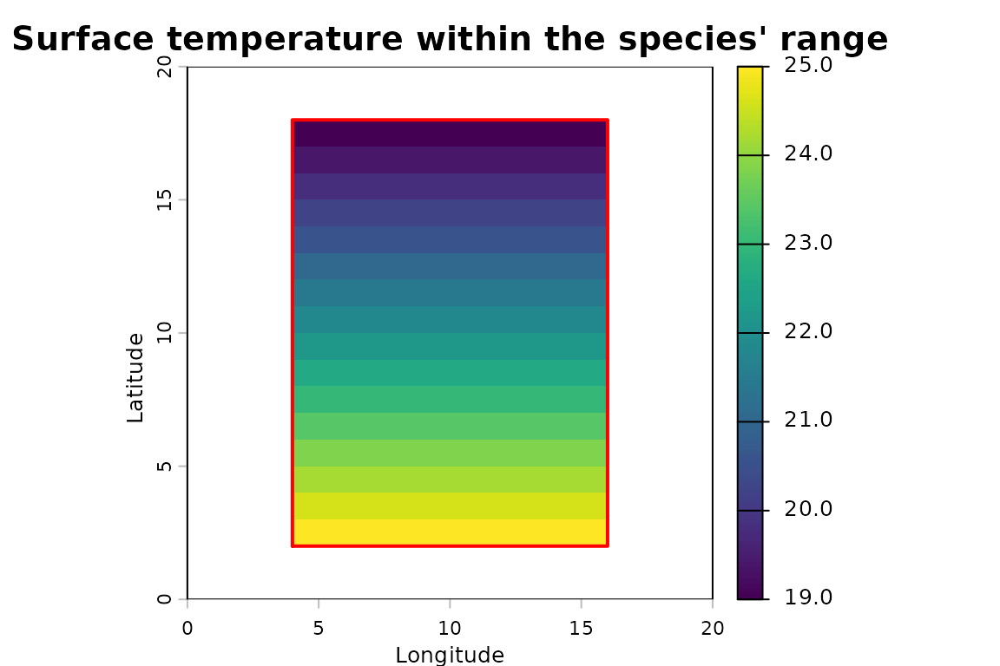

The coloured cells show sea surface temperature within our species’
potential distribution, while the red outline represents its original
geographical range polygon (temperature values outside the species’
potential distribution have previously been excluded).

### 5.3. Exploring the vertical temperature profile

We can investigate how environmental conditions change throughout the
water column. Let’s calculate the mean, minimum and maximum temperatures
within our species’ potential distribution at each depth level and count
the number of geographical cells contributing to these calculations.

``` r

# Calculate the mean, minimum and maximum temperature within the species' potential distribution at each depth.
per_depth <- terra::global(in_range, c("mean", "min", "max"), na.rm = TRUE)

# Extract the numerical depth associated with each layer.
per_depth$depth <- depths(rownames(per_depth))
#`depths()` accepts a character vector, making a per-layer

# Count how many cells contain temperature data at each depth (excluding cells outside the species' potential distribution).
per_depth$n_cells <- terra::global(!is.na(in_range), "sum", na.rm = TRUE)[, 1]

# Display the results.
per_depth[, c("depth", "n_cells", "mean", "min", "max")]
#>                depth n_cells mean  min  max
#> t_an_depth=0       0     192 22.0 19.0 25.0
#> t_an_depth=50     50     192 20.5 17.5 23.5
#> t_an_depth=100   100     192 19.0 16.0 22.0
#> t_an_depth=200   200     180 16.2 13.4 19.0
#> t_an_depth=500   500     120  8.2  6.4 10.0
```

Each row corresponds to one of our five depth levels. For each depth, we
obtain:

- `depth`: the corresponding depth level in metres.
- `n_cells`: the number of geographical cells contributing temperature
  values.
- `mean`, `min` and `max`: the temperature statistics calculated within
  our species’ potential distribution.

Finally, let’s visualise how mean temperature changes with depth.

``` r

# Visualise the mean temperature available to the species at each depth.
plot(
  per_depth$mean, per_depth$depth,
  type = "b",
  ylim = rev(range(per_depth$depth)),
  xlab = "Mean temperature (°C)",  ylab = "Depth (m)",
  main = "Temperature within the species' potential distribution",
  pch = 19)
```


This vertical profile shows the mean temperature within our species’
potential distribution at each depth level. Remember that the mean at
each depth is calculated using only the cells where our species could
potentially occur. Consequently, the geographical area contributing to
these statistics changes between depth levels.

**We have now combined geographical distribution, biological depth
limits, bathymetry and environmental data to characterise the
environmental conditions available within our species’ potential
three-dimensional distribution.**

## Step 6 (EXTRA - come back and check it out): Converting our results back into a `SpatEnvelope`

So far, we have used
[`envelope_to_voxel()`](https://marine-biodiversity-conservation-lab.github.io/ocean3d/reference/envelope_to_voxel.md)
to convert our species’ potential distribution into predefined depth
levels and combine it with environmental temperature data.

But what if we want to identify the minimum and maximum depths at which
a particular environmental condition occurs?

We can do this using
[`voxel_to_envelope()`](https://marine-biodiversity-conservation-lab.github.io/ocean3d/reference/voxel_to_envelope.md),
which converts a `SpatVoxel` back into a `SpatEnvelope`.

### 6.1. Identifying suitable temperature ranges

Let’s imagine that we are interested in identifying the depths within
our species’ potential distribution where temperature exceeds 20 °C.

We can use
[`voxel_to_envelope()`](https://marine-biodiversity-conservation-lab.github.io/ocean3d/reference/voxel_to_envelope.md)
with a condition that selects only temperature values above this
threshold.

``` r

# Identify the depth range where temperature exceeds 20 °C
# within our species' potential distribution.
warm <- voxel_to_envelope(in_range,  fun = function(x) x > 20)

# Examine the maximum depth of these warmer conditions.
range(terra::values(warm[["depth_max"]]),  na.rm = TRUE)
#> [1]   0 100
```

The resulting `SpatEnvelope` contains two raster layers: `depth_min` and
`depth_max`.

For each geographical cell, these layers describe the shallowest and
deepest sampled depth levels where temperature exceeds 20 °C within our
species’ potential distribution.

Notice that we are no longer representing temperature values at
individual depth levels. Instead, we are summarising the vertical extent
of the selected environmental condition.

Let’s visualise the resulting `SpatEnvelope` to see how the vertical
extent of warmer conditions varies across our species’ potential
distribution.

``` r

terra::plot(warm,
  main = c("Minimum depth (m)", "Maximum depth (m)"),
  xlab = "Longitude",  ylab = "Latitude")
```

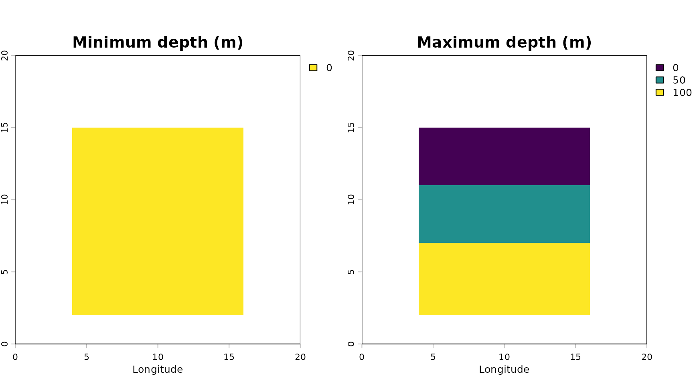

The first map represents the shallowest depth level satisfying our
temperature condition, while the second represents the deepest.
Together, they define the vertical envelope of warmer conditions within
our species’ potential distribution.

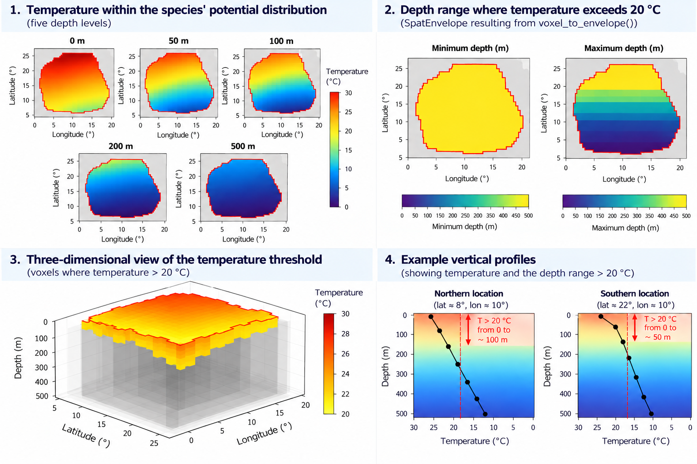**Figure 4.** Conceptual
representation of the identification of warmer waters (\>20 °C) within a
species’ potential three-dimensional distribution. **(1)** Temperature
at five predefined depth levels. **(2)** Minimum and maximum depths at
which temperature exceeds 20 °C, summarised as a `SpatEnvelope`. **(3)**
Three-dimensional representation of the selected voxels. **(4)**
Illustrative vertical temperature profiles showing how the depth range
satisfying the threshold varies between locations. This figure is
schematic and does not represent the exact numerical outputs of the
tutorial.

### 6.2. Understanding the limitations of this conversion

There is one important difference between `SpatVoxel` and
`SpatEnvelope`. A `SpatVoxel` can represent separate occupied depth
levels, including gaps between them. In contrast, a `SpatEnvelope`
stores a single continuous depth interval for each geographical cell.
Consequently, converting a `SpatVoxel` into a `SpatEnvelope` can result
in a loss of information.

For example, imagine that a geographical cell satisfies our temperature
condition at 0 m and 200 m, but not at 100 m. The resulting
`SpatEnvelope` would store a continuous interval from 0 to 200 m, even
though the condition was not satisfied at every intermediate depth
(still comes back as `[0, 200]`).

Additionally, the envelope records the original depth levels rather than
the intervals represented by those levels. This means that converting
the resulting envelope back into a voxel may not reproduce the original
data exactly.

**If preserving individual depth levels or gaps between them is
important for your analysis, keep your results as a `SpatVoxel`.**

## Summary

Congratulations! We have completed our first three-dimensional spatial
analysis using `ocean3d`.

Throughout this tutorial, we have:

1.  Created a synthetic study area with bathymetry and temperature data
    at five depth levels.
2.  Represented our species’ potential three-dimensional distribution
    using a `SpatEnvelope`.
3.  Converted this distribution into a `SpatVoxel` sharing the same
    depth levels as our temperature data.
4.  Combined both datasets to characterise the environmental conditions
    available within our species’ potential distribution.
5.  Converted our results back into a `SpatEnvelope` to identify the
    vertical extent of a selected environmental condition.

Although we explored each step separately to understand how these
objects work, `ocean3d` also provides a shorter approach.

Once our input data are ready, we can obtain temperature values within
our species’ three-dimensional distribution using just two main
operations:

``` r

# 1. Create the species' potential 3D distribution.
range_env <- vect_to_envelope(poly, grid, depth_min = 0, depth_max = list(600, seafloor))

# 2. Retain temperature values within that distribution.
in_range <- terra::mask(t_annual, range_env, bounds = "midpoint")

in_range
```

Here,
[`terra::mask()`](https://rspatial.github.io/terra/reference/mask.html)
automatically accounts for the species’ depth limits and local
bathymetry. It applies the envelope to the temperature dataset’s depth
levels, without requiring us to explicitly create an intermediate
occupancy voxel.

Alternatively, if we simply want to extract environmental data within a
geographical area and a fixed depth interval, we can use
[`extract_to_area()`](https://marine-biodiversity-conservation-lab.github.io/ocean3d/reference/extract_to_area.md).

You can now adapt this workflow to your own species distributions,
bathymetric datasets and environmental variables.

Throughout this tutorial, we have combined a species’ geographical
distribution, biological depth limits, bathymetry and environmental data
to characterise its potential three-dimensional habitat.

But this is only one of the possible applications of `ocean3d`. The
package includes additional tools for preparing real-world datasets,
extracting environmental information and quantifying three-dimensional
spatial overlap.

Below, we introduce some of these possibilities and provide resources to
help you take the next steps in your own research.

### Next steps: What else can you do with `ocean3d`?

**1. Prepare and integrate real-world marine data**

Throughout this tutorial, we have used synthetic data to understand how
`ocean3d` represents and analyses three-dimensional marine environments.

However, the package also provides tools to prepare and integrate
real-world datasets. We introduced several of these functions earlier in
the *Getting started: preparing our data* section.

**Species distributions and depth information**

- [`fetch_species_assessments()`](https://marine-biodiversity-conservation-lab.github.io/ocean3d/reference/fetch_species_assessments.md)
  retrieves species information from the IUCN Red List API, including
  taxonomic information, conservation status and reported depth limits.
  As mentioned earlier, geographical range polygons must be downloaded
  separately from the IUCN Spatial Data resources.

- [`fill_missing_depths()`](https://marine-biodiversity-conservation-lab.github.io/ocean3d/reference/fill_missing_depths.md)
  helps prepare species depth information for subsequent analyses. It
  corrects inconsistent minimum and maximum depth values and can
  estimate missing depth limits using genus-level averages. Remember
  that these estimated values introduce additional uncertainty into the
  analysis.

**Bathymetry and environmental data**

- [`load_gebco_bathymetry()`](https://marine-biodiversity-conservation-lab.github.io/ocean3d/reference/load_gebco_bathymetry.md)
  loads GEBCO bathymetric data from NetCDF files, providing information
  about seafloor depth that can be used to constrain species’ potential
  vertical distributions.

- [`woa_download()`](https://marine-biodiversity-conservation-lab.github.io/ocean3d/reference/woa_download.md)
  and
  [`woa_load_nc()`](https://marine-biodiversity-conservation-lab.github.io/ocean3d/reference/woa_load_nc.md)
  provide access to World Ocean Atlas 2023 climatologies. They allow you
  to download and prepare environmental variables, including
  temperature, salinity, dissolved oxygen and nutrients, at different
  geographical resolutions and temporal scales.

- `copernicus_load()` is being developed to facilitate access to
  Copernicus Marine products, including oceanographic datasets with
  temporal and vertical dimensions. Unlike climatological datasets,
  these products can support analyses of environmental conditions over
  specific periods. Check the package’s latest development version for
  availability.

**Preparing spatial data for analysis**

- [`create_study_raster()`](https://marine-biodiversity-conservation-lab.github.io/ocean3d/reference/create_study_raster.md)
  creates a common geographical grid covering the extent of one or more
  spatial datasets. This helps ensure that subsequent analyses use a
  consistent spatial framework.

- [`as_envelope()`](https://marine-biodiversity-conservation-lab.github.io/ocean3d/reference/as_envelope.md)
  and
  [`as_voxel()`](https://marine-biodiversity-conservation-lab.github.io/ocean3d/reference/as_voxel.md)
  allow you to construct the two principal three-dimensional
  representations used by `ocean3d` from existing raster datasets.

- [`gfw_effort_to_raster()`](https://marine-biodiversity-conservation-lab.github.io/ocean3d/reference/gfw_effort_to_raster.md)
  converts Global Fishing Watch apparent fishing-effort data into raster
  layers, which can be organised by fishing gear or other categories.
  These layers can subsequently be combined with assumptions about
  fishing-gear operating depths to investigate fishing activity in three
  dimensions.

Together, these functions provide the foundations for replacing our
synthetic example with real species distributions, environmental
datasets and human-pressure data.

**2. Extract environmental conditions from marine observations**

Our example characterised environmental conditions across a species’
potential distribution. However, you may also want to extract
environmental information at individual observation locations.

For example, you might have records of species captures, animal tracking
positions or biological sampling stations, each associated with a
location, date and depth.

[`extract_to_point()`](https://marine-biodiversity-conservation-lab.github.io/ocean3d/reference/extract_to_point.md)
allows you to associate these observations with environmental
information from NetCDF datasets.

Different extraction methods are available, including:

- [`extract2d()`](https://marine-biodiversity-conservation-lab.github.io/ocean3d/reference/extract2d.md)
  for environmental variables without a depth dimension.
- [`extract3d_nearest()`](https://marine-biodiversity-conservation-lab.github.io/ocean3d/reference/extract3d_nearest.md)
  for values at the nearest valid depth.
- [`extract3d_surface()`](https://marine-biodiversity-conservation-lab.github.io/ocean3d/reference/extract3d_surface.md)
  and
  [`extract3d_bottom()`](https://marine-biodiversity-conservation-lab.github.io/ocean3d/reference/extract3d_bottom.md)
  for surface and bottom conditions.
- [`extract3d_all()`](https://marine-biodiversity-conservation-lab.github.io/ocean3d/reference/extract3d_all.md)
  for obtaining several depth-specific values together.

Alternatively,
[`extract_to_area()`](https://marine-biodiversity-conservation-lab.github.io/ocean3d/reference/extract_to_area.md)
allows you to extract environmental data within a geographical area and
selected depth range.

**3. Investigate three-dimensional spatial overlap**

Another important application of `ocean3d` is investigating how
different marine distributions overlap in three-dimensional space.

For example:

- Where do the potential distributions of two species overlap?
- Which parts of a species’ habitat intersect with fishing activities?
- How does their overlap change when depth is considered?

The package provides
[`intersect_3d()`](https://marine-biodiversity-conservation-lab.github.io/ocean3d/reference/intersect_3d.md)
to identify shared three-dimensional space and
[`intersects_3d()`](https://marine-biodiversity-conservation-lab.github.io/ocean3d/reference/intersects_3d.md)
to determine whether spatial overlap occurs.

These functions allow you to investigate interactions that conventional
two-dimensional analyses may overlook.

**4. Quantify habitat volume and overlap**

Beyond identifying shared space, you may want to quantify its
three-dimensional extent.

[`volume()`](https://marine-biodiversity-conservation-lab.github.io/ocean3d/reference/volume.md)
calculates the volume represented by a `SpatEnvelope` or `SpatVoxel`.

Similarly,
[`calc_volume_overlap()`](https://marine-biodiversity-conservation-lab.github.io/ocean3d/reference/calc_volume_overlap.md)
calculates the spatially explicit volumes of two distributions and their
intersection.

These tools can support research questions involving habitat
availability, species interactions and potential exposure to human
activities.

### Apply the workflow to real-world datasets

Ready to explore these applications in more detail?

The following articles demonstrate how to use `ocean3d` with real-world
marine datasets.

Because these workflows involve downloading external data or require API
credentials, they are available on the package website rather than
installed with the package.

**[Extracting 3D Environmental Data for a Single
Species](https://marine-biodiversity-conservation-lab.github.io/ocean3d/articles/woa-environmental-extraction-single-species.html)**

Learn how to combine an IUCN species distribution with World Ocean Atlas
2023 climatologies to characterise environmental conditions throughout a
species’ potential three-dimensional habitat.

**[Depth-Stratified Fishing Effort from Global Fishing
Watch](https://marine-biodiversity-conservation-lab.github.io/ocean3d/articles/gfw-fishing-effort-3d.html)**

Explore how fishing-effort data from Global Fishing Watch can be
organised by fishing gear and depth to investigate their spatial overlap
with a species’ potential distribution.

**[3D Volume Overlap Between Species and
Fisheries](https://marine-biodiversity-conservation-lab.github.io/ocean3d/articles/bangladesh-fisheries-3d-overlap.html)**

Discover how
[`calc_volume_overlap()`](https://marine-biodiversity-conservation-lab.github.io/ocean3d/reference/calc_volume_overlap.md)
can be applied to species distributions and fishing footprints to
quantify their three-dimensional overlap.

### Explore the full package documentation

These examples represent only some of the possible applications of
`ocean3d`.

For further information about the available functions, their arguments
and additional examples, visit the [complete function
reference](https://marine-biodiversity-conservation-lab.github.io/ocean3d/reference/).

You can also explore the [package’s GitHub
repository](https://github.com/Marine-Biodiversity-Conservation-Lab/ocean3d)
to follow its development, report issues or contribute to the project.

## Feedback and contributing

ocean3d is new and under active development, so feedback from first-time
users is especially valuable. If something in this vignette was unclear,
a function did not behave as you expected, or there is functionality you
wish existed, please open an issue on [GitHub
Issues](https://github.com/Marine-Biodiversity-Conservation-Lab/ocean3d/issues).
A small reproducible example makes bugs much quicker to fix.

Contributions are welcome, from fixing a typo to adding a new workflow.
If you have written code for 3D marine analyses that others could reuse,
adding it to ocean3d broadens its impact. See the [contributing
guide](https://github.com/Marine-Biodiversity-Conservation-Lab/ocean3d/blob/main/CONTRIBUTING.md)
for how to get set up, and the [good first
issues](https://github.com/Marine-Biodiversity-Conservation-Lab/ocean3d/labels/good%20first%20issue)
for places to start. Please note that ocean3d is released with a
[Contributor Code of
Conduct](https://github.com/Marine-Biodiversity-Conservation-Lab/ocean3d/blob/main/CODE_OF_CONDUCT.md);
by contributing, you agree to abide by its terms.

### Contact us

Jay Matsushiba - <jay.matsushiba@gmail.com> David Ruiz-García -
<davidrg496@gmail.com>
