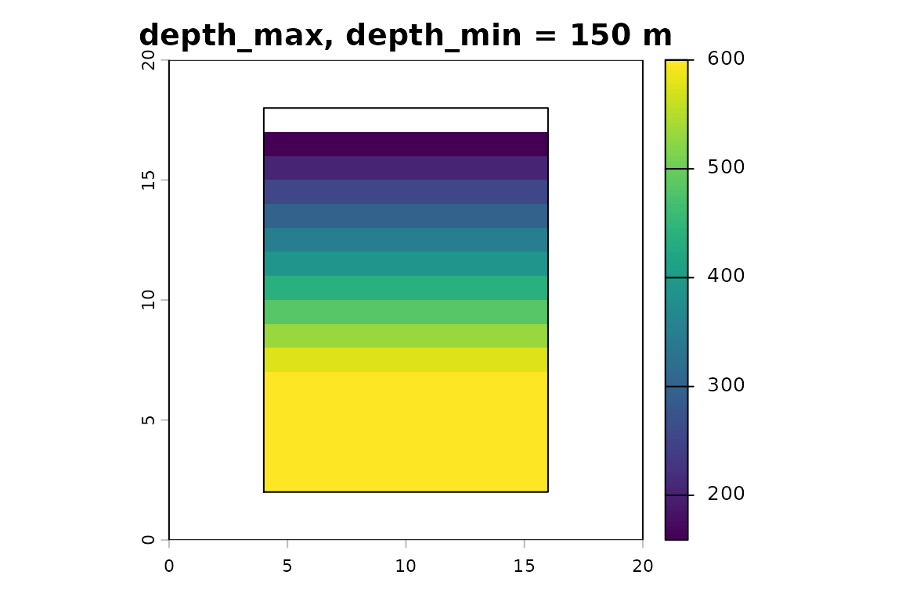

# Getting started with ocean3d

ocean3d analyses marine habitat in three dimensions: area *and* depth.
It can represent things like species ranges, fisheries and oceanographic
variables in 3D, so they can be overlapped, masked and summarised by
depth. ocean3d does this by representing space with a stacked raster
representation, which will be explained further in the next section.

## Extracting 3D Values Within a Species’ 3D Range

This article walks through one core operation of the package: taking a
species range **polygon**, convert it to 3D, and read the values from a
3D (raster stack by depth) oceanographic dataset.

| Object | What it is |
|----|----|
| `SpatEnvelope` | The species’ 3D range. Two layers, `depth_min` and `depth_max`; **depth is the cell value**, so the vertical interval varies per cell. |
| `SpatVoxel` | The environmental raster. One layer per standard depth, named `{variable}_depth={value}`; **depth is the layer index**. |

In this Getting Started vignette, we use small synthetic representative
datasets. Therefore, this requires no downloads and no local data files,
with grids that are small enough to print, so you can follow every step.
The [articles](#next-steps) listed at the end apply the same workflow to
real data.

``` r

library(ocean3d)
```

### Step 1: A study grid and a seafloor

> **Example data.** Steps 1 and 2 build synthetic stand-ins for the
> inputs a real analysis downloads. In practice the seafloor comes from
> GEBCO
> ([`load_gebco_bathymetry()`](https://marine-biodiversity-conservation-lab.github.io/ocean3d/reference/load_gebco_bathymetry.md))
> and the environmental raster from the World Ocean Atlas
> ([`woa_download()`](https://marine-biodiversity-conservation-lab.github.io/ocean3d/reference/woa_download.md),
> [`woa_load_nc()`](https://marine-biodiversity-conservation-lab.github.io/ocean3d/reference/woa_load_nc.md)).

The study grid defines the geometry everything else is aligned to. The
seafloor is depth in **positive metres increasing downward**, which is
the package’s convention. GEBCO’s elevation values have to be flipped.

``` r

grid <- terra::rast(
  nrows = 20, ncols = 20,
  xmin = 0, xmax = 20, ymin = 0, ymax = 20,
  crs = "EPSG:4326"
)

# A shelf that deepens from north to south, 20 m down to 900 m.
seafloor <- terra::rast(grid)
terra::values(seafloor) <- rep(seq(20, 900, length.out = 20), each = 20)

terra::plot(seafloor, main = "Seafloor depth (m)")
```


### Step 2: A WOA-shaped environmental raster, as a `SpatVoxel`

World Ocean Atlas data products are organized as one layer per standard
depth. Here, this shape is built by hand as example data. This synthetic
dataset shows temperature decreasing with depth, on a latitudinal
gradient.
[`as_voxel()`](https://marine-biodiversity-conservation-lab.github.io/ocean3d/reference/as_voxel.md)
attaches the layer names and validates the depth axis. With real WOA
data,
[`woa_load_nc()`](https://marine-biodiversity-conservation-lab.github.io/ocean3d/reference/woa_load_nc.md)
reads in the depth layers.

``` r

standard_depths <- c(0, 50, 100, 200, 500)

lat <- terra::init(terra::rast(grid), "y")
t_layers <- lapply(standard_depths, function(d) 26 - 0.03 * d - 0.4 * lat)

# This works with the woa_load_nc() return as input as well
t_annual <- as_voxel(
  terra::rast(t_layers),
  depths = standard_depths,
  varname = "t_an"
)

names(t_annual)
#> [1] "t_an_depth=0"   "t_an_depth=50"  "t_an_depth=100" "t_an_depth=200"
#> [5] "t_an_depth=500"
```

[`depths()`](https://marine-biodiversity-conservation-lab.github.io/ocean3d/reference/depths.md)
reads that axis back out. This is the helper function that returns the
numeric depths rather than the layer names:

``` r

depths(t_annual)
#> [1]   0  50 100 200 500
```

### Step 3: The species range polygon, as a `SpatEnvelope`

[`vect_to_envelope()`](https://marine-biodiversity-conservation-lab.github.io/ocean3d/reference/vect_to_envelope.md)
rasterises the polygon onto the study grid and attaches the depth
limits, giving the species’ 3D domain. For real data, the polygon is a
species range map, e.g. from the IUCN Red List Spatial Download, with
the depth limits coming from its IUCN Red List assessment
([`fetch_species_assessments()`](https://marine-biodiversity-conservation-lab.github.io/ocean3d/reference/fetch_species_assessments.md)).

The seafloor is not a special argument, and is treated as simply one
more `depth_max` constraint. Per cell the **shallowest** `depth_max`
wins, so a species with a 600 m limit is clamped to the seabed, in any
cells where the seabed is shallower than the species `depth_max`.

``` r

poly <- terra::vect(
  "POLYGON ((4 2, 16 2, 16 18, 4 18, 4 2))",
  crs = "EPSG:4326"
)

range_env <- vect_to_envelope(
  polygon   = poly,
  template  = grid,
  depth_min = 0,
  depth_max = list(600, seafloor)
)

range_env
#> class       : SpatRaster
#> size        : 20, 20, 2  (nrow, ncol, nlyr)
#> resolution  : 1, 1  (x, y)
#> extent      : 0, 20, 0, 20  (xmin, xmax, ymin, ymax)
#> coord. ref. : lon/lat WGS 84 (EPSG:4326)
#> source(s)   : memory
#> names       : depth_min,  depth_max
#> min values  :         0, 112.631579
#> max values  :         0,        600
```

Depth is the cell value here, and the interval is per cell — the
northern rows are clamped to a shallow bed, the southern rows reach the
full 600 m:

``` r

range(terra::values(range_env[["depth_max"]]), na.rm = TRUE)
#> [1] 112.6316 600.0000
```

``` r

terra::plot(range_env)
```


Cells where the bed sits above `depth_min` have no water column left and
drop out entirely. A species living below 150 m cannot occupy the
northernmost row of the polygon, where the bed is only about 113 m deep:

``` r

deep_env <- vect_to_envelope(
  polygon   = poly,
  template  = grid,
  depth_min = 150,
  depth_max = list(600, seafloor)
)

# Occupied cells: the full polygon, then the deeper-living species.
sum(!is.na(terra::values(range_env[["depth_max"]])))
#> [1] 192
sum(!is.na(terra::values(deep_env[["depth_max"]])))
#> [1] 180
```

``` r

terra::plot(deep_env[["depth_max"]], main = "depth_max, depth_min = 150 m")
terra::lines(poly)
```



### Step 4: Put the envelope on the voxel’s depth axis

The envelope and the voxel store depth in different roles, so they
cannot be combined directly.
[`envelope_to_voxel()`](https://marine-biodiversity-conservation-lab.github.io/ocean3d/reference/envelope_to_voxel.md)
re-expresses the envelope on the voxel’s depth levels, giving a `1`/`NA`
occupancy voxel with one layer per depth.

Each depth level stands for a slab of water, not a single depth. WOA
levels stand for the water halfway to their neighbours, so
`bounds = "midpoint"` is the convention to use with WOA data. See
[`vignette("depth-levels", package = "ocean3d")`](https://marine-biodiversity-conservation-lab.github.io/ocean3d/articles/depth-levels.md)
for how slabs are placed and why it matters.

``` r

occ <- envelope_to_voxel(
  range_env,
  depths = depths(t_annual),
  bounds = "midpoint"
)

# Cells occupied at each standard depth.
terra::global(occ, "sum", na.rm = TRUE)
#>                    sum
#> presence_depth=0   192
#> presence_depth=50  192
#> presence_depth=100 192
#> presence_depth=200 180
#> presence_depth=500 120
```

``` r

terra::plot(
  occ, nc = 3, legend = FALSE, col = "steelblue",
  main = paste(depths(occ), "m")
)
```


### Step 5: Read the values inside the range

With both objects on the same depth axis, masking can use
[`terra::mask()`](https://rspatial.github.io/terra/reference/mask.html):

``` r

in_range <- terra::mask(t_annual, occ)

names(in_range)
#> [1] "t_an_depth=0"   "t_an_depth=50"  "t_an_depth=100" "t_an_depth=200"
#> [5] "t_an_depth=500"
```

The layer names are maintained, so that a single depth can still be
pulled out by name. For example, sea surface temperature within the
range:

``` r

sst <- in_range[["t_an_depth=0"]]
summary(terra::values(sst, na.rm = TRUE)[, 1])
#>    Min. 1st Qu.  Median    Mean 3rd Qu.    Max. 
#>    19.0    20.5    22.0    22.0    23.5    25.0
```

``` r

terra::plot(sst, main = "Surface temperature within the range")
terra::lines(poly)
```


#### Vertical profile

[`depths()`](https://marine-biodiversity-conservation-lab.github.io/ocean3d/reference/depths.md)
also accepts a character vector, making a per-layer
[`terra::global()`](https://rspatial.github.io/terra/reference/global.html)
result easy to turn into a profile.

``` r

per_depth <- terra::global(in_range, c("mean", "min", "max"), na.rm = TRUE)
per_depth$depth <- depths(rownames(per_depth))
per_depth$n_cells <- terra::global(!is.na(in_range), "sum", na.rm = TRUE)[, 1]

per_depth[, c("depth", "n_cells", "mean", "min", "max")]
#>                depth n_cells mean  min  max
#> t_an_depth=0       0     192 22.0 19.0 25.0
#> t_an_depth=50     50     192 20.5 17.5 23.5
#> t_an_depth=100   100     192 19.0 16.0 22.0
#> t_an_depth=200   200     180 16.2 13.4 19.0
#> t_an_depth=500   500     120  8.2  6.4 10.0
```

The cell count falls with depth: the range is clamped to the bed, so the
northern rows drop out of the deeper levels.

``` r

plot(
  per_depth$mean, per_depth$depth,
  type = "b", ylim = rev(range(per_depth$depth)),
  xlab = "Mean temperature (°C)", ylab = "Depth (m)"
)
```


### Step 6: Collapsing back to an envelope

[`voxel_to_envelope()`](https://marine-biodiversity-conservation-lab.github.io/ocean3d/reference/voxel_to_envelope.md)
is the return trip: it reduces a voxel to the envelope bounding it. A
predicate decides what counts as present, so it can bound a subset of
the values rather than just the data extent — here, the depths over
which the range is warmer than 20 °C:

``` r

warm <- voxel_to_envelope(in_range, fun = function(x) x > 20)
range(terra::values(warm[["depth_max"]]), na.rm = TRUE)
#> [1]   0 100
```

This conversion is **lossy**, so a round trip through
[`envelope_to_voxel()`](https://marine-biodiversity-conservation-lab.github.io/ocean3d/reference/envelope_to_voxel.md)
does not give back the voxel you started from:

- An envelope holds one continuous interval per cell, so any interior
  gap in the voxel is filled in — a cell satisfying the predicate at 0 m
  and 200 m but not at 100 m still comes back as `[0, 200]`.
- The envelope records depth *levels*, not the slabs they stand for. A
  cell warm only at the 0 m level comes back as `[0, 0]`, although that
  level stands for 0–25 m of water. Expanded again, such a
  zero-thickness interval occupies no slab at all, and the cell is lost.

Where either matters, stay in the voxel.

### Summary

Once the inputs are loaded, the whole workflow is two calls:

``` r

# 1. the species' 3D range
range_env <- vect_to_envelope(poly, grid, depth_min = 0,
                              depth_max = list(600, seafloor))

# 2. the values inside the range
in_range <- terra::mask(t_annual, range_env, bounds = "midpoint")
```

The second is the one line to reach for whenever a voxel needs
restricting to a species’ per-cell depth window.
[`terra::mask()`](https://rspatial.github.io/terra/reference/mask.html)
is depth-aware for the package’s 3D classes: it places the envelope on
the voxel’s own depth levels, as
[`envelope_to_voxel()`](https://marine-biodiversity-conservation-lab.github.io/ocean3d/reference/envelope_to_voxel.md)
did by hand in Step 4, and masks layer by layer.

To restrict a voxel to a polygon and a single depth band across the
whole area instead — no per-cell window — use
[`extract_to_area()`](https://marine-biodiversity-conservation-lab.github.io/ocean3d/reference/extract_to_area.md).

### Next steps

These articles apply the workflow to real data. They download data or
need API keys, so they are on the package website rather than installed
with the package:

- [Extracting 3D Environmental Data for a Single
  Species](https://marine-biodiversity-conservation-lab.github.io/ocean3d/articles/woa-environmental-extraction-single-species.html)
  — an IUCN range and World Ocean Atlas 2023 climatologies.
- [Depth-Stratified Fishing Effort from Global Fishing
  Watch](https://marine-biodiversity-conservation-lab.github.io/ocean3d/articles/gfw-fishing-effort-3d.html)
  — Global Fishing Watch effort by gear type, overlapped with a species
  range.
- [3D Volume Overlap Between Species and
  Fisheries](https://marine-biodiversity-conservation-lab.github.io/ocean3d/articles/bangladesh-fisheries-3d-overlap.html)
  —
  [`calc_volume_overlap()`](https://marine-biodiversity-conservation-lab.github.io/ocean3d/reference/calc_volume_overlap.md)
  on species ranges and fishery footprints.

### Feedback and contributing

ocean3d is new and under active development, so feedback from first-time
users is especially valuable. If something in this vignette was unclear,
a function did not behave as you expected, or there is functionality you
wish existed, please open an issue on [GitHub
Issues](https://github.com/Marine-Biodiversity-Conservation-Lab/ocean3d/issues).
A small reproducible example makes bugs much quicker to fix.

Contributions are welcome, from fixing a typo to adding a new workflow.
If you have written code for 3D marine analyses that others could reuse,
adding it to ocean3d broadens its impact. See the [contributing
guide](https://github.com/Marine-Biodiversity-Conservation-Lab/ocean3d/blob/main/CONTRIBUTING.md)
for how to get set up, and the [good first
issues](https://github.com/Marine-Biodiversity-Conservation-Lab/ocean3d/labels/good%20first%20issue)
for places to start. Please note that ocean3d is released with a
[Contributor Code of
Conduct](https://github.com/Marine-Biodiversity-Conservation-Lab/ocean3d/blob/main/CODE_OF_CONDUCT.md);
by contributing, you agree to abide by its terms.
